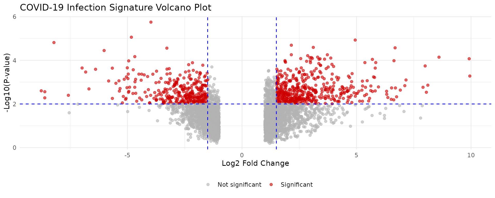
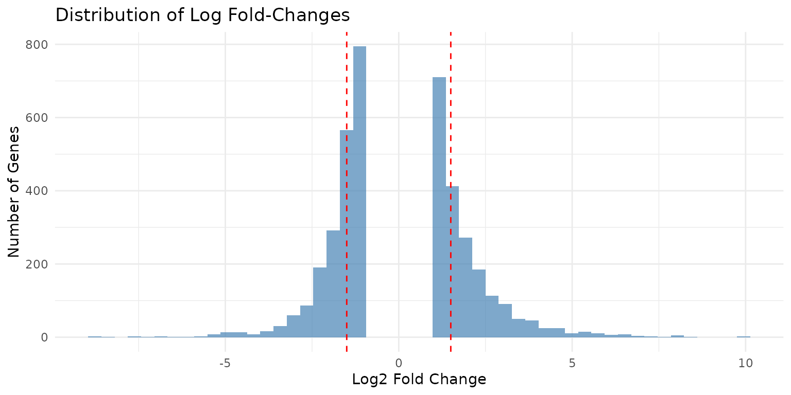

# Drug Repurposing from Transcriptomic Data

## Introduction

Drug repurposing (also called drug repositioning) is the process of
identifying new therapeutic uses for existing drugs. This approach
offers several advantages over traditional drug discovery:

- **Reduced development time**: Existing drugs have known safety
  profiles
- **Lower costs**: Skip early-stage development and toxicity testing
- **Higher success rates**: Known pharmacokinetics and pharmacodynamics
- **Rapid clinical translation**: Faster path to patient benefit

This vignette demonstrates how to use **drugfindR** to identify
candidate repurposable drugs from transcriptomic signatures of disease
states.

## Prerequisites

``` r

library(drugfindR)
library(dplyr)
library(readr)
library(ggplot2)
library(tidyr)
```

## The Drug Repurposing Workflow

The typical workflow involves:

1.  **Obtain disease signature**: Differential expression analysis from
    disease vs. control
2.  **Prepare signature**: Format for iLINCS compatibility
3.  **Filter genes**: Select most differentially expressed genes
4.  **Query iLINCS**: Find drugs with opposing signatures
    (anti-correlated)
5.  **Rank candidates**: Prioritize based on similarity scores
6.  **Validate**: Literature review, experimental validation

## Case Study: COVID-19 Drug Repurposing

We’ll use a published COVID-19 transcriptomic signature to demonstrate
the workflow. This example replicates aspects of the analysis from
[O’Donovan et al. (2021)](https://doi.org/10.1038/s41598-021-84044-9).

### Step 1: Load Disease Signature

``` r

# Load pre-computed differential expression results
covid_file <- system.file("extdata", "dCovid_diffexp.tsv", package = "drugfindR")
covid_diffexp <- read_tsv(covid_file, show_col_types = FALSE)

# Examine the data structure
cat("Dimensions:", nrow(covid_diffexp), "genes x", ncol(covid_diffexp), "columns\n")
#> Dimensions: 4090 genes x 3 columns
head(covid_diffexp)
#> # A tibble: 6 × 3
#>   hgnc_symbol logFC     PValue
#>   <chr>       <dbl>      <dbl>
#> 1 CCL4L2      -3.98 0.00000177
#> 2 IL5RA       -4.83 0.00000870
#> 3 FN1          4.94 0.0000117 
#> 4 GSTM1       -8.21 0.0000153 
#> 5 CD180        2.15 0.0000202 
#> 6 FAM20C       3.11 0.0000255
```

This dataset contains differential expression results from SARS-CoV-2
infected cells:

- **hgnc_symbol**: HGNC gene symbols
- **logFC**: Log2 fold-change (infected vs. control)
- **PValue**: Statistical significance

``` r

# Summary statistics
cat(
    "Log fold-change range:",
    round(min(covid_diffexp$logFC), 2), "to",
    round(max(covid_diffexp$logFC), 2), "\n"
)
#> Log fold-change range: -8.76 to 9.95
cat(
    "Significant genes (p < 0.01):",
    sum(covid_diffexp$PValue < 0.01), "\n"
)
#> Significant genes (p < 0.01): 1044
```

### Step 2: Visualize the Signature

Understanding your signature helps inform filtering decisions.

``` r

# Volcano plot
ggplot(covid_diffexp, aes(x = logFC, y = -log10(PValue))) +
    geom_point(aes(color = abs(logFC) > 1.5 & PValue < 0.01),
        alpha = 0.6, size = 1.5
    ) +
    scale_color_manual(
        values = c("gray70", "red3"),
        labels = c("Not significant", "Significant"),
        name = ""
    ) +
    geom_vline(xintercept = c(-1.5, 1.5), linetype = "dashed", color = "blue") +
    geom_hline(yintercept = -log10(0.01), linetype = "dashed", color = "blue") +
    labs(
        title = "COVID-19 Infection Signature Volcano Plot",
        x = "Log2 Fold Change",
        y = "-Log10(P-value)"
    ) +
    theme_minimal() +
    theme(legend.position = "bottom")
```



``` r

# Distribution of log fold-changes
ggplot(covid_diffexp, aes(x = logFC)) +
    geom_histogram(bins = 50, fill = "steelblue", alpha = 0.7) +
    geom_vline(xintercept = c(-1.5, 1.5), linetype = "dashed", color = "red") +
    labs(
        title = "Distribution of Log Fold-Changes",
        x = "Log2 Fold Change",
        y = "Number of Genes"
    ) +
    theme_minimal()
```



### Step 3: Choose Filtering Strategy

#### Strategy A: Absolute Threshold

Select genes with large magnitude changes:

``` r

# Prepare signature for iLINCS
signature <- prepareSignature(
    covid_diffexp,
    geneColumn = "hgnc_symbol",
    logfcColumn = "logFC",
    pvalColumn = "PValue"
)

cat("Signature prepared with", nrow(signature), "L1000 genes\n")
#> Signature prepared with 170 L1000 genes
```

``` r

# Filter with symmetric threshold
filtered_threshold <- filterSignature(signature, threshold = 1.5)
cat("Genes with |logFC| >= 1.5:", nrow(filtered_threshold), "\n")
#> Genes with |logFC| >= 1.5: 87

# Separate by direction
up_genes <- filterSignature(signature, direction = "up", threshold = 1.5)
down_genes <- filterSignature(signature, direction = "down", threshold = 1.5)

cat("Upregulated (>= 1.5):", nrow(up_genes), "\n")
#> Upregulated (>= 1.5): 72
cat("Downregulated (<= -1.5):", nrow(down_genes), "\n")
#> Downregulated (<= -1.5): 15
```

#### Strategy B: Proportional Threshold

Select a fixed percentage of most extreme genes:

``` r

# Top and bottom 5% most differentially expressed
filtered_prop <- filterSignature(signature, prop = 0.05)
cat("Top/bottom 5%:", nrow(filtered_prop), "genes\n")
#> Top/bottom 5%: 18 genes

# Compare strategies
cat("\nComparing strategies:\n")
#> 
#> Comparing strategies:
cat("Absolute threshold (1.5):", nrow(filtered_threshold), "genes\n")
#> Absolute threshold (1.5): 87 genes
cat("Proportional (5%):", nrow(filtered_prop), "genes\n")
#> Proportional (5%): 18 genes
```

#### Strategy C: Asymmetric Threshold

Different thresholds for up and down regulation:

``` r

# More stringent for upregulation
filtered_asym <- filterSignature(signature, threshold = c(-1.0, 2.0))
cat(
    "Asymmetric filtering (down <= -1.0, up >= 2.0):",
    nrow(filtered_asym), "genes\n"
)
#> Asymmetric filtering (down <= -1.0, up >= 2.0): 73 genes
```

### Step 4: Query iLINCS for Concordant Drugs

``` r

# Query Chemical Perturbagen library
concordants_up <- getConcordants(
    up_genes,
    ilincsLibrary = "CP",
    direction = "up"
)

concordants_down <- getConcordants(
    down_genes,
    ilincsLibrary = "CP",
    direction = "down"
)

cat("Concordant signatures found:\n")
cat("  Up-regulated matches:", nrow(concordants_up), "\n")
cat("  Down-regulated matches:", nrow(concordants_down), "\n")
```

### Step 5: Generate Consensus Rankings

``` r

# Combine and rank candidates
consensus <- consensusConcordants(
    concordants_up,
    concordants_down,
    paired = TRUE,
    cutoff = 0.2 # Minimum absolute similarity
)

# Preview results
head(consensus, 15)
```

### Step 6: One-Step Convenience Function

For standard workflows, use the convenience function:

``` r

# Complete analysis in one call
drug_candidates <- investigateSignature(
    expr = covid_diffexp,
    outputLib = "CP",
    filterThreshold = 1.5,
    similarityThreshold = 0.2,
    paired = TRUE,
    geneColumn = "hgnc_symbol",
    logfcColumn = "logFC",
    pvalColumn = "PValue",
    sourceName = "COVID19_Infection",
    sourceCellLine = "HumanLungCells"
)

# View top candidates
head(drug_candidates, 20)
```

## Interpreting Results

### Understanding Similarity Scores

The similarity score indicates concordance between signatures:

- **-1.0 to -0.3**: Strong opposition (drug reverses disease signature)
  ⭐
- **-0.3 to 0**: Weak opposition
- **0 to 0.3**: Weak agreement
- **0.3 to 1.0**: Strong agreement (drug mimics disease)

For drug repurposing, we want **negative similarity scores**
(anti-correlated).

### Filtering Candidate Results

``` r

# Identify top therapeutic candidates
therapeutic_candidates <- drug_candidates %>%
    filter(Similarity < -0.3) %>% # Strong opposition
    arrange(Similarity) %>% # Most opposing first
    distinct(Target, .keep_all = TRUE) # Unique drugs

# View top 10 candidates
head(therapeutic_candidates, 10)
```

### Considering Statistical Significance

``` r

# Filter by both similarity and significance
high_confidence <- drug_candidates %>%
    filter(Similarity < -0.3, pValue < 0.05) %>%
    arrange(Similarity)

cat("High-confidence candidates:", nrow(high_confidence), "\n")
```

## Cell Line-Specific Analysis

Different cell lines may respond differently to treatments.

### Restricting to Relevant Cell Lines

``` r

# For lung disease, focus on lung-derived cell lines
lung_candidates <- investigateSignature(
    expr = covid_diffexp,
    outputLib = "CP",
    filterThreshold = 1.5,
    outputCellLines = c("A549", "HBEC3KT", "NCI-H1299"),
    geneColumn = "hgnc_symbol",
    logfcColumn = "logFC",
    pvalColumn = "PValue"
)
```

### Analyzing Cross-Cell Line Consistency

``` r

# Get results without cell line restriction
all_celllines <- investigateSignature(
    expr = covid_diffexp,
    outputLib = "CP",
    filterThreshold = 1.5,
    geneColumn = "hgnc_symbol",
    logfcColumn = "logFC",
    pvalColumn = "PValue"
)

# Identify drugs active across multiple cell lines
multi_cellline <- all_celllines %>%
    group_by(Target) %>%
    summarize(
        n_celllines = n_distinct(TargetCellLine),
        mean_similarity = mean(Similarity),
        .groups = "drop"
    ) %>%
    filter(n_celllines >= 3, mean_similarity < -0.3) %>%
    arrange(mean_similarity)

head(multi_cellline, 10)
```

## Comparing Paired vs. Unpaired Analysis

### Paired Analysis

Treats up- and down-regulated genes separately:

``` r

results_paired <- investigateSignature(
    expr = covid_diffexp,
    outputLib = "CP",
    filterThreshold = 1.5,
    paired = TRUE, # Separate up/down analysis
    geneColumn = "hgnc_symbol",
    logfcColumn = "logFC",
    pvalColumn = "PValue"
)
```

**Advantages:** - Captures directional biology - More precise matching -
Better for asymmetric signatures

### Unpaired Analysis

Treats all significant genes together:

``` r

results_unpaired <- investigateSignature(
    expr = covid_diffexp,
    outputLib = "CP",
    filterThreshold = 1.5,
    paired = FALSE, # Combined analysis
    geneColumn = "hgnc_symbol",
    logfcColumn = "logFC",
    pvalColumn = "PValue"
)
```

**Advantages:** - Simpler interpretation - Faster execution - Good for
symmetric signatures

### Comparing Results

``` r

# Compare number of candidates
cat("Paired analysis candidates:", nrow(results_paired), "\n")
cat("Unpaired analysis candidates:", nrow(results_unpaired), "\n")

# Find overlap in top candidates
top_paired <- results_paired %>%
    filter(Similarity < -0.3) %>%
    pull(Target)

top_unpaired <- results_unpaired %>%
    filter(Similarity < -0.3) %>%
    pull(Target)

overlap <- intersect(top_paired, top_unpaired)
cat("Overlap in top candidates:", length(overlap), "\n")
```

## Visualization of Results

### Top Candidates Bar Plot

``` r

top_20 <- drug_candidates %>%
    filter(Similarity < 0) %>%
    arrange(Similarity) %>%
    head(20)

ggplot(top_20, aes(x = reorder(Target, Similarity), y = Similarity)) +
    geom_col(aes(fill = Similarity < -0.3), show.legend = FALSE) +
    scale_fill_manual(values = c("steelblue", "red3")) +
    coord_flip() +
    labs(
        title = "Top 20 Drug Candidates for COVID-19",
        x = "Drug/Compound",
        y = "Similarity Score (more negative = better)"
    ) +
    theme_minimal() +
    theme(axis.text.y = element_text(size = 10))
```

### Similarity Distribution

``` r

ggplot(drug_candidates, aes(x = Similarity)) +
    geom_histogram(bins = 50, fill = "steelblue", alpha = 0.7) +
    geom_vline(xintercept = -0.3, linetype = "dashed", color = "red", size = 1) +
    geom_vline(xintercept = 0, linetype = "solid", color = "black") +
    labs(
        title = "Distribution of Drug Similarity Scores",
        x = "Similarity Score",
        y = "Number of Drug Signatures",
        subtitle = "Red line: therapeutic threshold (-0.3)"
    ) +
    theme_minimal()
```

### Cell Line Heatmap

``` r

# Prepare data for heatmap
heatmap_data <- drug_candidates %>%
    filter(Similarity < -0.2) %>%
    group_by(Target) %>%
    filter(n() >= 2) %>% # Drugs tested in multiple cell lines
    ungroup() %>%
    select(Target, TargetCellLine, Similarity) %>%
    head(50) # Top candidates

ggplot(heatmap_data, aes(x = TargetCellLine, y = Target, fill = Similarity)) +
    geom_tile(color = "white") +
    scale_fill_gradient2(
        low = "blue", mid = "white", high = "red",
        midpoint = 0,
        name = "Similarity"
    ) +
    labs(
        title = "Drug Activity Across Cell Lines",
        x = "Cell Line",
        y = "Drug"
    ) +
    theme_minimal() +
    theme(
        axis.text.x = element_text(angle = 45, hjust = 1),
        axis.text.y = element_text(size = 8)
    )
```

## Working with DESeq2 Output

Integration with standard Bioconductor workflows:

``` r

# Assume you have DESeq2 results
# library(DESeq2)
# dds <- DESeq(dds)
# res <- results(dds)

# Convert DESeq2 results to data frame
# deseq2_results <- as.data.frame(res) %>%
#     tibble::rownames_to_column("gene") %>%
#     filter(!is.na(padj))

# Use with drugfindR
# drug_candidates <- investigateSignature(
#     expr = deseq2_results,
#     outputLib = "CP",
#     filterThreshold = 1.5,
#     geneColumn = "gene",
#     logfcColumn = "log2FoldChange",
#     pvalColumn = "pvalue"
# )
```

## Working with edgeR Output

``` r

# Assume you have edgeR results
# library(edgeR)
# et <- exactTest(dge)
# edger_results <- topTags(et, n = Inf)$table

# Convert to appropriate format
# edger_df <- edger_results %>%
#     tibble::rownames_to_column("gene")

# Use with drugfindR
# drug_candidates <- investigateSignature(
#     expr = edger_df,
#     outputLib = "CP",
#     filterThreshold = 1.5,
#     geneColumn = "gene",
#     logfcColumn = "logFC",
#     pvalColumn = "PValue"
# )
```

## Best Practices

### 1. Threshold Selection

- **Conservative (1.5-2.0)**: High confidence, fewer genes
- **Moderate (1.0-1.5)**: Balanced approach (recommended starting point)
- **Liberal (0.5-1.0)**: Broader coverage, more candidates
- **Proportional (5-10%)**: Data-adaptive approach

### 2. Quality Control

``` r

# Check for adequate differential expression
sig_genes <- sum(abs(covid_diffexp$logFC) > 1.0)
if (sig_genes < 50) {
    warning("Few significantly DE genes. Consider lowering threshold.")
}

# Verify L1000 gene coverage
l1000_coverage <- nrow(signature) / nrow(covid_diffexp) * 100
cat("L1000 gene coverage:", round(l1000_coverage, 1), "%\n")
```

### 3. Validation Strategy

After computational screening:

1.  **Literature validation**: Check PubMed for prior evidence
2.  **Mechanism review**: Understand drug’s known mechanisms
3.  **Safety assessment**: Review known side effects
4.  **Dose consideration**: Consider therapeutic dose ranges
5.  **Experimental validation**: In vitro/in vivo testing

### 4. Multiple Hypothesis Testing

``` r

# Adjust p-values for multiple comparisons
drug_candidates_adjusted <- drug_candidates %>%
    mutate(pValue_adjusted = p.adjust(pValue, method = "BH"))

# Filter with adjusted p-values
validated_candidates <- drug_candidates_adjusted %>%
    filter(Similarity < -0.3, pValue_adjusted < 0.05)
```

## Advanced Filtering Scenarios

### Scenario 1: Highly Specific Signature

Few but very strong changes:

``` r

specific_results <- investigateSignature(
    expr = covid_diffexp,
    outputLib = "CP",
    filterThreshold = 2.5, # Very stringent
    similarityThreshold = 0.3, # Higher similarity required
    paired = TRUE,
    geneColumn = "hgnc_symbol",
    logfcColumn = "logFC",
    pvalColumn = "PValue"
)
```

### Scenario 2: Broad Signature

Many moderate changes:

``` r

broad_results <- investigateSignature(
    expr = covid_diffexp,
    outputLib = "CP",
    filterProp = 0.15, # Top/bottom 15%
    similarityThreshold = 0.15, # Lower threshold
    paired = TRUE,
    geneColumn = "hgnc_symbol",
    logfcColumn = "logFC",
    pvalColumn = "PValue"
)
```

### Scenario 3: Direction-Specific Interest

Only interested in downregulated genes:

``` r

# Manual approach for maximum control
sig_prepared <- prepareSignature(covid_diffexp, geneColumn = "hgnc_symbol")
down_only <- filterSignature(sig_prepared, direction = "down", threshold = 1.5)
down_concordants <- getConcordants(down_only, ilincsLibrary = "CP")
down_consensus <- consensusConcordants(down_concordants, paired = FALSE, cutoff = 0.2)
```

## Troubleshooting

### Empty Results

If you get no results:

``` r

# 1. Lower filtering threshold
relaxed_results <- investigateSignature(
    expr = covid_diffexp,
    outputLib = "CP",
    filterThreshold = 0.5, # Lower threshold
    geneColumn = "hgnc_symbol"
)

# 2. Use proportional filtering
prop_results <- investigateSignature(
    expr = covid_diffexp,
    outputLib = "CP",
    filterProp = 0.2, # Top 20%
    geneColumn = "hgnc_symbol"
)

# 3. Lower similarity threshold
liberal_results <- investigateSignature(
    expr = covid_diffexp,
    outputLib = "CP",
    filterThreshold = 1.0,
    similarityThreshold = 0.1, # Very permissive
    geneColumn = "hgnc_symbol"
)
```

### Too Many Results

If results are overwhelming:

``` r

# Increase thresholds
stringent_results <- investigateSignature(
    expr = covid_diffexp,
    outputLib = "CP",
    filterThreshold = 2.0, # More stringent
    similarityThreshold = 0.3, # Higher cutoff
    geneColumn = "hgnc_symbol"
)

# Focus on specific cell lines
focused_results <- investigateSignature(
    expr = covid_diffexp,
    outputLib = "CP",
    filterThreshold = 1.5,
    outputCellLines = c("A549", "MCF7", "PC3"),
    geneColumn = "hgnc_symbol"
)
```

## Summary

Key takeaways for drug repurposing with drugfindR:

1.  **Start with quality DE data**: Strong differential expression
    signal
2.  **Choose appropriate thresholds**: Balance sensitivity and
    specificity
3.  **Use paired analysis**: For complex, asymmetric signatures
4.  **Look for negative similarity**: Anti-correlated drugs are
    therapeutic candidates
5.  **Consider cell line context**: Tissue-relevant models
6.  **Validate computationally**: Literature, mechanisms, safety
7.  **Plan experimental validation**: Essential for translation

## Next Steps

- **[Target
  Investigation](https://cogdisreslab.github.io/drugfindR/articles/target-investigation.md)**:
  Explore gene-drug relationships
- **[Getting
  Started](https://cogdisreslab.github.io/drugfindR/articles/getting-started.md)**:
  Quick start guide
- **[Function
  Reference](https://cogdisreslab.github.io/drugfindR/reference/)**:
  Complete API documentation

## Session Information

``` r

sessionInfo()
#> R version 4.6.1 (2026-06-24)
#> Platform: x86_64-pc-linux-gnu
#> Running under: Ubuntu 24.04.4 LTS
#> 
#> Matrix products: default
#> BLAS:   /usr/lib/x86_64-linux-gnu/openblas-pthread/libblas.so.3 
#> LAPACK: /usr/lib/x86_64-linux-gnu/openblas-pthread/libopenblasp-r0.3.26.so;  LAPACK version 3.12.0
#> 
#> locale:
#>  [1] LC_CTYPE=C.UTF-8       LC_NUMERIC=C           LC_TIME=C.UTF-8       
#>  [4] LC_COLLATE=C.UTF-8     LC_MONETARY=C.UTF-8    LC_MESSAGES=C.UTF-8   
#>  [7] LC_PAPER=C.UTF-8       LC_NAME=C              LC_ADDRESS=C          
#> [10] LC_TELEPHONE=C         LC_MEASUREMENT=C.UTF-8 LC_IDENTIFICATION=C   
#> 
#> time zone: UTC
#> tzcode source: system (glibc)
#> 
#> attached base packages:
#> [1] stats     graphics  grDevices utils     datasets  methods   base     
#> 
#> other attached packages:
#> [1] tidyr_1.3.2         ggplot2_4.0.3       readr_2.2.0        
#> [4] dplyr_1.2.1         drugfindR_0.99.1170 BiocStyle_2.40.0   
#> 
#> loaded via a namespace (and not attached):
#>  [1] utf8_1.2.6          rappdirs_0.3.4      sass_0.4.10        
#>  [4] generics_0.1.4      stringi_1.8.7       hms_1.1.4          
#>  [7] digest_0.6.39       magrittr_2.0.5      RColorBrewer_1.1-3 
#> [10] evaluate_1.0.5      grid_4.6.1          bookdown_0.47      
#> [13] fastmap_1.2.0       jsonlite_2.0.0      DFplyr_1.6.0       
#> [16] BiocManager_1.30.27 purrr_1.2.2         scales_1.4.0       
#> [19] httr2_1.2.3         textshaping_1.0.5   jquerylib_0.1.4    
#> [22] cli_3.6.6           crayon_1.5.3        rlang_1.3.0        
#> [25] bit64_4.8.2         withr_3.0.3         cachem_1.1.0       
#> [28] yaml_2.3.12         otel_0.2.0          parallel_4.6.1     
#> [31] tools_4.6.1         tzdb_0.5.0          BiocGenerics_0.58.1
#> [34] curl_7.1.0          vctrs_0.7.3         R6_2.6.1           
#> [37] stats4_4.6.1        lifecycle_1.0.5     stringr_1.6.0      
#> [40] bit_4.6.0           S4Vectors_0.50.1    fs_2.1.0           
#> [43] htmlwidgets_1.6.4   vroom_1.7.1         ragg_1.5.2         
#> [46] pkgconfig_2.0.3     desc_1.4.3          pkgdown_2.2.1      
#> [49] pillar_1.11.1       bslib_0.11.0        gtable_0.3.6       
#> [52] glue_1.8.1          systemfonts_1.3.2   xfun_0.60          
#> [55] tibble_3.3.1        tidyselect_1.2.1    knitr_1.51         
#> [58] farver_2.1.2        htmltools_0.5.9     labeling_0.4.3     
#> [61] rmarkdown_2.31      compiler_4.6.1      S7_0.2.2
```

## References

1.  O’Donovan SM, Imami A, et al. (2021). Identification of candidate
    repurposable drugs to combat COVID-19 using a signature-based
    approach. *Scientific Reports*, 11:4495.

2.  Pushpakom S, et al. (2019). Drug repurposing: progress, challenges
    and recommendations. *Nature Reviews Drug Discovery*, 18:41-58.

3.  Subramanian A, et al. (2017). A Next Generation Connectivity Map:
    L1000 Platform and the First 1,000,000 Profiles. *Cell*,
    171(6):1437-1452.
